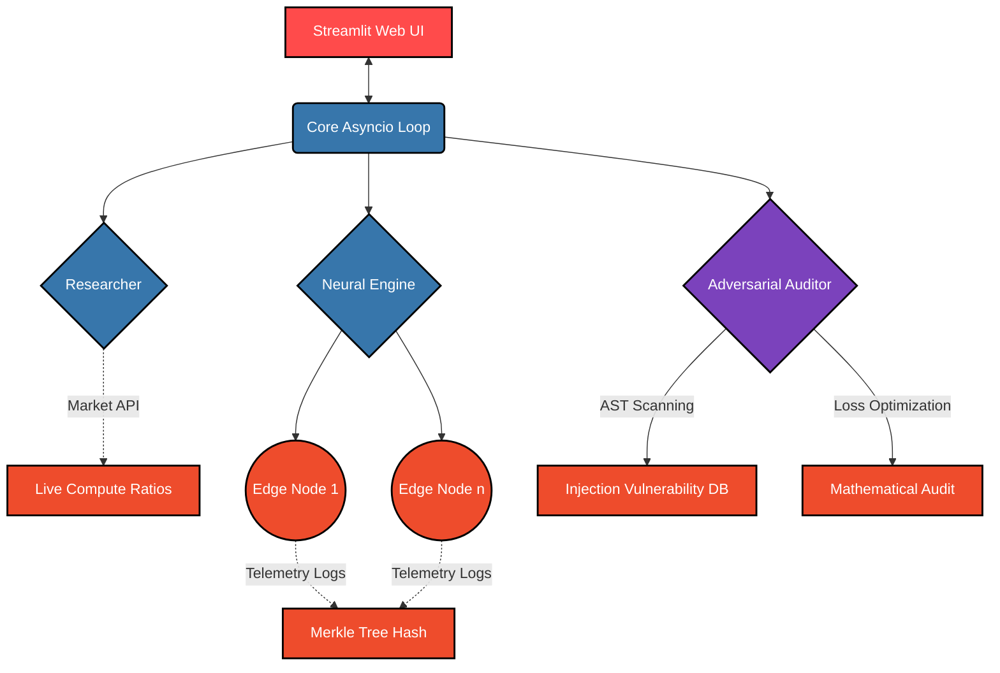

<div align="center">
  

  [](https://git.io/typing-svg)

  <p align="center">
    <a href="https://python.org"></a>
    <a href="https://pytorch.org"></a>
    <a href="https://streamlit.io"></a>
    <a href="https://kubernetes.io"></a>
    <a href="https://terraform.io"></a>
  </p>
</div>

---

## 🌌 Overview

**AEGIS-CORE** is a next-generation neural operations dashboard. Designed for massive concurrent edge-node processing, it natively integrates a dynamic multi-modal research engine, automated adversarial threat injection scanning, and real-time cryptographic integrity validation via scalable Merkle trees.

---

## 🔥 System Architecture

The core relies on a highly concurrent `asyncio` loop running underneath a sleek **Streamlit** reactive frontend.



## ⚡ Core Features

<details>
<summary><b>1️⃣ Multi-Modal Researcher</b></summary>
<br>
Continuously monitors live GPU Spot Pricing (A100 equivalents) and market sentiment (VIX) vs Hashrate compute densities to produce intelligent Compute-to-Market ratios instantaneously.
</details>

<details>
<summary><b>2️⃣ Neural Execution Engine</b></summary>
<br>
A robust <code>PyTorch nn.Linear</code> predictor continuously learning the volatility-to-efficiency mapping asynchronously across 50 multiplexed edge nodes. Cryptographic state is validated using SHA-256 Merkle block algorithms.
</details>

<details>
<summary><b>3️⃣ Automated Adversarial Auditor</b></summary>
<br>
Acts as a zero-trust red-team parameter over the platform. Every execution triggers an Abstract Syntax Tree (AST) injection scan and Mean Squared Error (MSE) manipulation validation.
</details>

---

## 🚀 Quick Start Guide

### Prerequisites
* Python `3.11`
* `pip` or `uv` environments

### Execution

```bash
# 1. Clone the repository
git clone https://github.com/siddhantchandorkar752-ai/aegis-core.git
cd aegis-core

# 2. Configure the local environment
python -m venv .venv
# On Windows use: .venv\Scripts\activate

# 3. Install core dependencies
pip install -r requirements.txt

# 4. Boot the Neural Dashboard
streamlit run main.py
```

<div align="center">
  <sub>Built with 🖤 for high-density neural operations. </sub>
</div>
